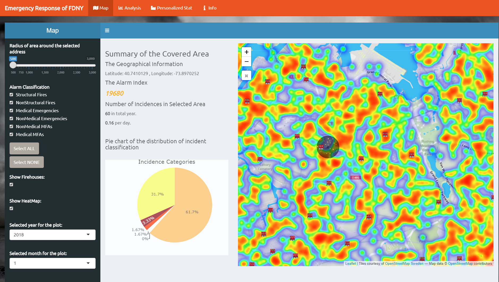

# Project 2: Shiny App Development Version 2.0

### [Project Description](doc/project2_desc.md)



In this second project of GR5243 Applied Data Science, we develop a version 2.0 of an *Exploratory Data Analysis and Visualization* shiny app on emergency reports related to FDNY using [NYC Open Data](https://data.cityofnewyork.us/Public-Safety/Fire-Incident-Dispatch-Data/8m42-w767). See [Project 2 Description](doc/project2_desc.md) for more details.  

The **learning goals** for this project is:

- business intelligence for data science
- study legacy codes and further development
- data cleaning
- data visualization
- systems development/design life cycle
- shiny app/shiny server

*The above general statement about project 2 can be removed once you are finished with your project. It is optional.

## Project Title Lorem ipsum dolor sit amet
Term: Fall 2019

+ Team # 11
+ **Emergency Response of FDNY**:
	+ Rui Wang
	+ Daniel Schmidle
	+ Huize Huang
	+ Ivan Wolansky
	+ Jiawei Liu

+ **Project summary**: Our Shiny App is about all the emergency reports related to FDNY, constructing a map to clearly visualize the emergency locations. Our main target audience is the FDNY. This app can help them easily understand the overall situations in NYC, making rational allocation of resources. It will be meaningful if they deploy more firehouses within the area of higher emergency frequencies in the city. What's more, New York citizens are also encouraged to check our app when considering the safety factors of their future houses.

+ **Contribution statement**: ([default](doc/a_note_on_contributions.md)) All team members contributed equally in all stages of this project. All team members approve our work presented in this GitHub repository including this contributions statement. 

Following [suggestions](http://nicercode.github.io/blog/2013-04-05-projects/) by [RICH FITZJOHN](http://nicercode.github.io/about/#Team) (@richfitz). This folder is orgarnized as follows.

```
proj/
├── app/
├── lib/
├── data/
├── doc/
└── output/
```

Please see each subfolder for a README file.

